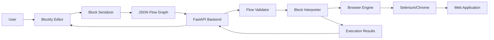

# Visual Web Testing Platform - Architecture

## Overview

This platform enables **zero-code** web testing through visual block-based flows. Users create test scenarios by dragging and dropping blocks (similar to Scratch), which are then executed by a hidden browser automation engine.

## Core Principles

1. **Zero-Code Constraint**: End users NEVER write, see, or edit code
2. **Visual Blocks as Truth**: Blocks are the canonical representation of tests
3. **Hidden Complexity**: Selenium/Playwright completely abstracted
4. **User-Friendly**: All errors and messages in plain English
5. **Intent-Based**: Users express what they want, not how to do it

## System Architecture



## Data Flow

### 1. Block Creation (Frontend)
- User drags blocks in Blockly editor
- Blocks connect visually to form flow
- Each block has configurable fields (selectors, text, conditions)

### 2. Serialization (Frontend)
- Blockly workspace  JSON flow graph
- Block connections  `next_block`, `then_block`, `else_block`, `loop_block` references
- Validation ensures all references are valid

### 3. Validation (Backend)
- Pydantic models validate JSON structure
- Reference validation ensures no dangling pointers
- Field validation (URLs, timeouts, etc.)

### 4. Execution (Backend)
- Interpreter traverses flow graph from `entry_block`
- Each block type has dedicated execution logic
- Browser engine performs actual automation

### 5. Results (Backend  Frontend)
- Execution logs with emojis for readability
- Success/failure status
- Plain English error messages
- List of executed blocks

## Component Details

### Frontend Components

#### Blockly Editor
- Visual workspace for block manipulation
- Custom block definitions from `blockly-blocks.json`
- Color-coded by category:
  - **Blue (210)**: Navigation blocks
  - **Green (120)**: Interaction blocks
  - **Purple (290)**: Wait blocks
  - **Teal (65)**: Assertion blocks
  - **Pink (330)**: Control flow blocks

#### Block Serializer (`block-serializer.ts`)
- Converts Blockly workspace to JSON
- Generates unique block IDs
- Handles nested blocks (if/repeat)
- Validates flow structure

### Backend Components

#### Data Models (`models.py`)
- **Pydantic models** for type safety and validation
- **Block types**: OpenPageBlock, ClickElementBlock, EnterTextBlock, etc.
- **FlowGraph**: Root model with entry point and block list
- **ExecutionResult**: Standardized result format

#### Browser Engine (`browser_engine.py`)
- **Abstract interface**: `BrowserEngine` ABC
- **Selenium implementation**: `SeleniumEngine`
- **Features**:
  - Auto-wait for elements (explicit waits)
  - Retry on stale elements (up to 3 attempts)
  - Multiple selector strategies (CSS, XPath, ID, Name, Text)
  - Plain English error translation

#### Block Interpreter (`interpreter.py`)
- **Execution context**: Maintains state, logs, loop counters
- **Block execution**: Type-specific handlers for each block
- **Control flow**:
  - Sequential: Follow `next_block` chain
  - Conditional: Evaluate condition, branch to `then_block` or `else_block`
  - Loops: Execute `loop_block` until condition met or max iterations

#### FastAPI Application (`main.py`)
- **REST API** for flow operations
- **Endpoints**:
  - `GET /api/blocks/types`: List available blocks
  - `POST /api/flows/validate`: Validate without executing
  - `POST /api/flows/execute`: Execute flow and return results
- **Error handling**: Catches all exceptions, returns user-friendly messages

## Block Type Specifications

### Navigation Blocks

#### Open Page
```json
{
  "type": "open_page",
  "url": "https://example.com"
}
```
- Navigates to URL
- Waits for page load completion

### Interaction Blocks

#### Click Element
```json
{
  "type": "click_element",
  "selector": "#button",
  "selector_type": "css"
}
```
- Waits for element to be clickable
- Clicks element

#### Enter Text
```json
{
  "type": "enter_text",
  "selector": "#input",
  "selector_type": "css",
  "text": "Hello",
  "clear_first": true
}
```
- Optionally clears existing text
- Types text into input field

### Wait Blocks

#### Wait Until Visible
```json
{
  "type": "wait_until_visible",
  "selector": ".loading",
  "selector_type": "css",
  "timeout_seconds": 10
}
```
- Waits up to timeout for element to appear
- Throws error if timeout exceeded

### Assertion Blocks

#### Assert Visible
```json
{
  "type": "assert_visible",
  "selector": ".success",
  "selector_type": "css"
}
```
- Checks if element is visible
- Throws error if not visible

### Control Flow Blocks

#### If Condition
```json
{
  "type": "if_condition",
  "condition": "element_visible",
  "selector": ".modal",
  "selector_type": "css",
  "then_block": "block_x",
  "else_block": "block_y"
}
```
- Evaluates condition
- Executes then_block if true, else_block if false
- Continues to next_block after branch completes

#### Repeat Until
```json
{
  "type": "repeat_until",
  "condition": "element_visible",
  "selector": ".done",
  "selector_type": "css",
  "loop_block": "block_z",
  "max_iterations": 10
}
```
- Executes loop_block repeatedly
- Checks condition after each iteration
- Exits when condition met or max iterations reached

## Selector Strategies

| Type | Description | Example |
|------|-------------|---------|
| `css` | CSS selector | `#id`, `.class`, `div > p` |
| `xpath` | XPath expression | `//div[@class='test']` |
| `id` | Element ID | `login-button` |
| `name` | Element name attribute | `username` |
| `text` | Link text content | `Click here` |

## Condition Types

| Condition | Description |
|-----------|-------------|
| `element_exists` | Element is in DOM (may not be visible) |
| `element_visible` | Element is visible on page |
| `element_not_visible` | Element is not visible (or doesn't exist) |

## Error Handling

### User-Friendly Error Messages

All errors are translated to plain English:

| Technical Error | User Message |
|----------------|--------------|
| `NoSuchElementException` | "Could not find element with css selector: '#button'. Please check if the element exists on the page." |
| `TimeoutException` | "The element '#loading' did not become visible within 10 seconds." |
| `StaleElementReferenceException` | "The element '#button' became stale and could not be interacted with. The page may have changed." |
| `ElementNotInteractableException` | "Could not click on '#button' because it's not visible or is blocked by another element." |

### Error Response Format

```json
{
  "success": false,
  "message": "Could not find element with css selector: '#button'",
  "logs": [
    " Opening page: https://example.com",
    " Page loaded successfully",
    " Clicking: #button",
    " Error: Could not find element..."
  ],
  "error_block_id": "block_3",
  "executed_blocks": ["block_1", "block_2", "block_3"]
}
```

## Extending the Platform

### Adding a New Block Type

1. **Define Pydantic model** in `models.py`:
```python
class NewBlock(BaseBlock):
    type: Literal[BlockType.NEW_BLOCK] = BlockType.NEW_BLOCK
    # Add block-specific fields
```

2. **Add to BlockType enum**:
```python
class BlockType(str, Enum):
    NEW_BLOCK = "new_block"
```

3. **Implement browser engine method** in `browser_engine.py`:
```python
def new_action(self, param: str) -> None:
    # Implementation
```

4. **Add interpreter handler** in `interpreter.py`:
```python
def _execute_new_block(self, block: NewBlock) -> None:
    # Execution logic
```

5. **Create Blockly definition** in `blockly-blocks.json`:
```json
{
  "type": "new_block",
  "message0": "New action %1",
  "args0": [...]
}
```

6. **Update serializer** in `block-serializer.ts`:
```typescript
case 'new_block':
  return { ...baseBlock, param: block.getFieldValue('PARAM') };
```

## Deployment

### Docker Deployment

```bash
docker-compose up -d
```

- Backend runs on port 8000
- Frontend runs on port 5173
- Chrome runs in headless mode inside container

### Production Considerations

1. **Security**:
   - Configure CORS appropriately
   - Add authentication/authorization
   - Validate all user inputs

2. **Scalability**:
   - Use Selenium Grid for parallel execution
   - Queue system for flow execution
   - Database for flow storage

3. **Monitoring**:
   - Log execution metrics
   - Track success/failure rates
   - Monitor browser resource usage

## Future Enhancements

1. **Playwright Support**: Add Playwright as alternative engine
2. **Visual Assertions**: Screenshot comparison blocks
3. **Data Extraction**: Blocks to extract and store data
4. **Variables**: Support for dynamic values
5. **Scheduling**: Scheduled flow execution
6. **Reporting**: Detailed test reports with screenshots
